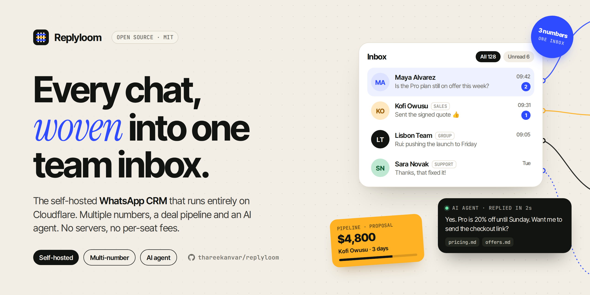
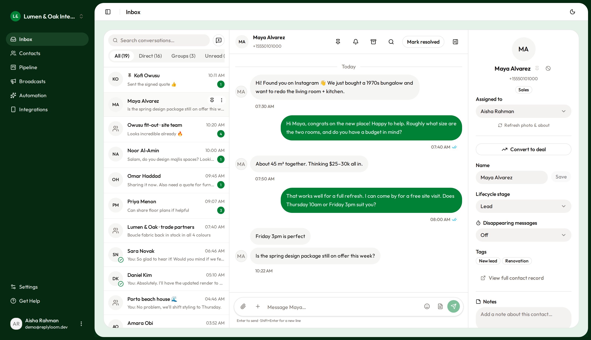
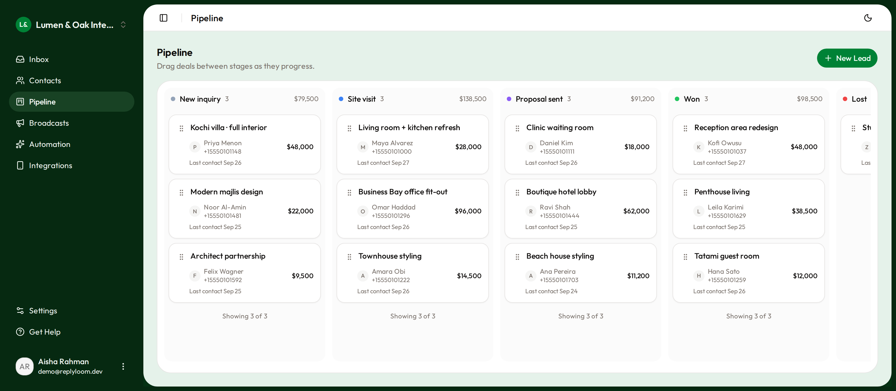
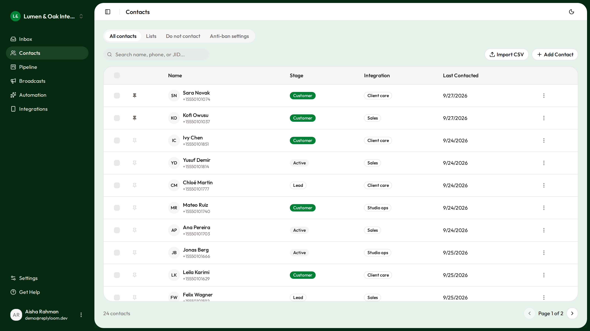
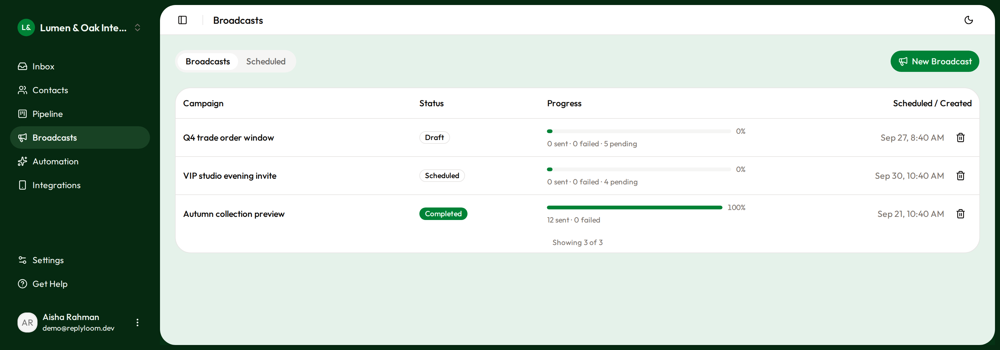
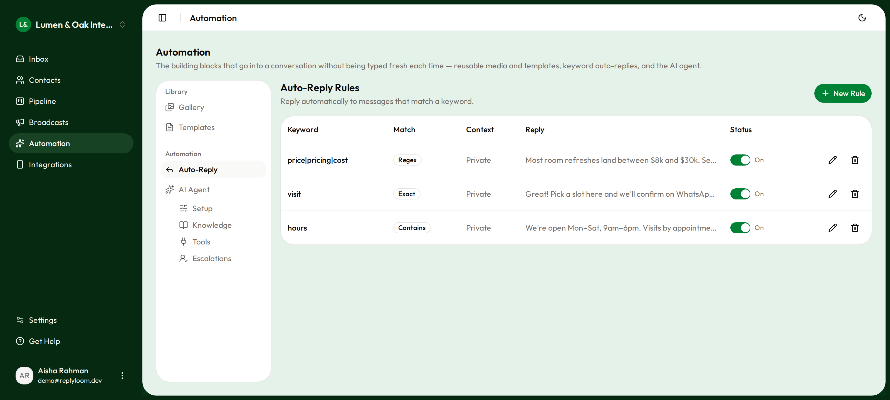

<div align="center">



# Replyloom

**Open-source, self-hosted WhatsApp CRM that runs entirely on Cloudflare.**

Shared team inbox · multiple numbers · contacts & deal pipeline · safe broadcasts · auto-replies · AI support agent

[](./LICENSE)
[](https://workers.cloudflare.com)
[](https://www.typescriptlang.org)
[](./CONTRIBUTING.md)

[Quick start](#quick-start-self-hosting) · [Features](#features) · [FAQ](#faq) · [Architecture](./ARCHITECTURE.md) · [Deploy guide](./DEPLOY.md)

</div>

**Replyloom is a free, open-source WhatsApp CRM you host on your own Cloudflare account.** You link one or more WhatsApp numbers by scanning a QR code. Your team gets a shared inbox, contact management, a sales pipeline, scheduled messages, keyword auto-replies and an optional AI agent that answers from your own docs. There's no VPS, no external database and no per-seat pricing. Everything runs on Cloudflare Workers, Durable Objects and D1, and your data stays in your account.

> [!CAUTION]
> **Unofficial. Use at your own risk.** Replyloom is **not affiliated with, endorsed by, or connected to WhatsApp or Meta**. It connects through [Baileys](https://github.com/WhiskeySockets/Baileys), an unofficial WhatsApp Web client, and does **not** use the official WhatsApp Business Platform. WhatsApp can restrict or ban any number that uses unofficial clients. **Do not use it to spam:** no unsolicited bulk messaging and no cold outreach to numbers that never opted in. Read [DISCLAIMER.md](./DISCLAIMER.md) before linking a number you care about.

## Screenshots



<table>
<tr>
<td width="50%"><p align="center"><b>Deal pipeline</b></p></td>
<td width="50%"><p align="center"><b>Contacts</b></p></td>
</tr>
<tr>
<td width="50%"><p align="center"><b>Broadcasts</b></p></td>
<td width="50%"><p align="center"><b>Auto-replies</b></p></td>
</tr>
</table>

<sub>All data shown is fictional demo data from <code>pnpm seed:demo</code>.</sub>

## At a glance

| | |
|---|---|
| **What it is** | Self-hosted WhatsApp CRM and shared team inbox |
| **License** | MIT (free for commercial use) |
| **Hosting** | Your own Cloudflare account (Workers, Durable Objects, D1, R2, Queues, Vectorize) |
| **WhatsApp connection** | Linked device via QR code (WhatsApp Web protocol, through Baileys) |
| **Numbers** | Several per workspace, each an isolated session |
| **Team** | Workspaces, invitations, roles and permissions |
| **AI** | Optional RAG support agent on Workers AI, with human handoff |
| **Stack** | TypeScript, React 19, TanStack Start, Drizzle ORM, Tailwind, shadcn/ui |

## Who it's for

- **Small businesses and support teams** that answer customers on WhatsApp and want one shared inbox instead of one phone passed around.
- **Agencies and freelancers** who run several client numbers from one dashboard.
- **Developers** who want a hackable WhatsApp CRM with webhooks, an API and full control of the data, instead of a closed SaaS.

## Features

- **Shared WhatsApp team inbox**: direct and group chats with real-time updates over WebSockets, unread/pinned/archived tabs, assignment and exact counts.
- **Multiple WhatsApp numbers**: link several numbers to one workspace. Each runs as its own isolated Durable Object session and stays online without a browser open.
- **Contacts & sales pipeline**: tags, notes, lifecycle stages, CSV import and a drag-and-drop deal board.
- **Safe broadcasts to opted-in lists**: per-campaign ceilings, warm-up caps, random send gaps, circuit breakers and automatic STOP/opt-out handling (see [Responsible use](#responsible-use)).
- **Scheduled messages**: send at an exact time, driven by a Durable Object alarm instead of polling.
- **Keyword auto-replies**: exact, contains or regex rules (ReDoS-safe), per number or workspace-wide.
- **AI support agent (optional)**: answers from your own docs (RAG over Vectorize), calls tools and webhooks, refuses what it can't ground in your docs, and hands off to a human when unsure.
- **Message templates**: reusable text with `{{name}}` variables and an optional attachment.
- **Webhooks & REST API**: signed outbound webhooks for message events, plus workspace-scoped API keys.
- **Semantic search**: search message history by meaning, using Workers AI embeddings.
- **Teams & permissions**: workspaces, invitations and custom roles.
- **Security built in**: tenant isolation, per-IP rate limits, SSRF guards, sandboxed media, security headers and PII-scrubbed error reporting.

## How Replyloom compares

| | Replyloom | Hosted WhatsApp CRM (SaaS) | Official Cloud API + your own code |
|---|---|---|---|
| Cost | Your Cloudflare usage only | Monthly per seat or per number | Per-conversation fees + your hosting |
| Data location | Your Cloudflare account | Vendor's servers | Wherever you build it |
| Setup | QR scan, no Meta business verification | Sign up | Meta business verification, templates |
| Bulk marketing | Not suited (unofficial client, ban risk) | Varies | ✅ The right tool |
| Customizable | Full source, MIT | Limited | Full, but you build everything |

**Rule of thumb:** use Replyloom for conversational support and sales with people who message you. Use the official [WhatsApp Business Platform](https://developers.facebook.com/docs/whatsapp/cloud-api) for marketing at scale.

## Stack

| Layer | Tech |
|---|---|
| CRM app (`apps/web`) | TanStack Start (React 19, Router, Query), Tailwind v4, shadcn/ui, Better Auth |
| WhatsApp engine (`apps/worker`) | Cloudflare Workers + Durable Objects running Baileys (patched for Workers) |
| Data | D1 (SQLite) via Drizzle ORM, R2 (media), KV (agent cache), Queues (broadcast dispatch), Vectorize + Workers AI (search & RAG) |
| Tooling | pnpm workspaces, Turborepo, Vitest, TypeScript |

See [ARCHITECTURE.md](./ARCHITECTURE.md) for how the pieces fit together.

## Quick start (self-hosting)

**Prerequisites:** a Cloudflare account (the free tier is enough to try it), Node 22+, and pnpm (`corepack enable`).

```bash
git clone https://github.com/thareekanvar/replyloom.git && cd replyloom
pnpm install
pnpm exec wrangler login

pnpm setup     # creates D1, R2, Queue, Vectorize, KV; applies migrations; generates secrets
```

Then, before the first deploy:

1. `pnpm install` created your local, gitignored config from the templates: `apps/web/wrangler.jsonc`, `apps/worker/wrangler.jsonc` and `apps/web/.env.production` (`pnpm setup` has already written your D1/KV ids into them). Set the URLs to **your** domains: `BETTER_AUTH_URL` (web), `CORS_ORIGIN` (worker) and `VITE_ENGINE_URL` (web `wrangler.jsonc` + `.env.production`). Edit these files, never the `*.example` templates.
2. Optional: set `RESEND_API_KEY` on `apps/web` so invitation emails are actually sent, and `SENTRY_DSN` (both Workers) / `VITE_SENTRY_DSN` (`.env.production`) for error reporting. Sentry is off unless you set these.
3. `pnpm deploy`. It refuses to run while template placeholders are still in your config.
4. Open the app, sign up (you get a personal workspace), go to **Integrations**, add a session and scan the QR code with *WhatsApp → Linked devices*.

Both scripts are idempotent. [DEPLOY.md](./DEPLOY.md) covers every step by hand, plus multiple environments, backups, custom domains and monitoring.

## Known limitations

- **Single D1 database.** Every workspace shares one D1 database (hot paths are indexed and keyset-paginated). That's fine for small and medium deployments, but it hasn't been load-tested at large scale. Per-workspace sharding is on the roadmap.
- **No full-text search yet.** Search is semantic (Vectorize) only. FTS comes after sharding, so matches can't cross tenants.
- **Unofficial WhatsApp client.** The engine uses Baileys, not the official Cloud API. Numbers can get banned. Read [DISCLAIMER.md](./DISCLAIMER.md).
- **CSP is report-only.** The full Content-Security-Policy ships as `Content-Security-Policy-Report-Only`. Enforce it in `apps/web/src/server.ts` once your browser console is clean.

## Local development

```bash
pnpm install
cp apps/web/.dev.vars.example apps/web/.dev.vars        # fill in the values
cp apps/worker/.dev.vars.example apps/worker/.dev.vars  # secrets must match web's

cd apps/web && npx wrangler d1 migrations apply whatsapp-ai --local && cd ../..
pnpm dev       # web on :3000, engine on :8787
```

**Demo data:** set the `DB` binding in `apps/web/wrangler.jsonc` to `"remote": false` (so the app reads the local database), sign up at http://localhost:3000, then run `pnpm seed:demo` to fill your workspace with a fictional interior-design studio (3 numbers, 24 contacts, chats, groups, deals, lists, broadcasts, templates and auto-replies). It only writes to the local database, and re-running it replaces the previous demo data.

| Command | What it does |
|---|---|
| `pnpm dev` | Run both apps locally |
| `pnpm seed:demo` | Fill your local workspace with fictional demo data |
| `pnpm typecheck` / `pnpm lint` | Typecheck / lint every package |
| `pnpm --filter worker test` / `pnpm --filter web test` | Vitest suites |
| `pnpm --filter @workspace/db generate` | Generate a Drizzle migration after a schema change |
| `bash scripts/check-patches.sh` | Verify the Baileys patch still applies |

Add UI components with `pnpm dlx shadcn@latest add <component> -c apps/web`. They land in `packages/ui` and are imported as `@workspace/ui/components/<component>`.

## Responsible use

The app pushes you toward sane behaviour, but it can't make an unofficial client safe for bulk messaging:

- Broadcasts can only go to **contact lists**, with a per-campaign recipient ceiling, a warm-up daily cap for newly linked numbers, a per-contact cooldown, 15–45 s random gaps between sends, circuit breakers that stop on failure spikes, and required personalization.
- **STOP / opt-out** replies (in several languages) suppress a contact workspace-wide.
- **Every** outbound send is paced, first messages to new numbers are capped per day, and auto-replies have loop breakers.
- The project will **not** add proxy/IP rotation, fingerprint spoofing or message-spinning to dodge WhatsApp's spam detection. PRs that do will be closed.

If you need marketing or bulk messaging, use the official [WhatsApp Business Platform (Cloud API)](https://developers.facebook.com/docs/whatsapp/cloud-api), which has opt-in rules, approved templates and proper sending tiers.

## Project layout

```
apps/web        CRM app (TanStack Start): UI + server functions
apps/worker     WhatsApp engine: Durable Objects (Baileys), queue consumer, scheduler, AI agent
packages/db     Shared Drizzle schema + SQL migrations
packages/ui     Shared shadcn/ui components
scripts/        setup / deploy / patch-check scripts
```

## FAQ

### What is Replyloom?
Replyloom is a free, open-source (MIT) WhatsApp CRM that you self-host on Cloudflare. It gives a team a shared WhatsApp inbox, contacts, a deal pipeline, scheduled messages, auto-replies and an optional AI support agent.

### Is Replyloom free?
Yes. The software is MIT-licensed and free, including for commercial use. You pay only for your own Cloudflare usage. The free tier is enough to try it. For production, use a Workers Paid plan (rate limiting needs it).

### Does it use the official WhatsApp Business API?
No. Replyloom links to WhatsApp as a *linked device* (like WhatsApp Web) through the unofficial Baileys library. That means no Meta business verification and no per-conversation fees, but WhatsApp can ban numbers that use unofficial clients. See [DISCLAIMER.md](./DISCLAIMER.md).

### Will my WhatsApp number get banned?
It can happen with any unofficial client, and nobody can guarantee otherwise. Replyloom lowers the risk by pacing every outbound message, capping first contacts, honoring STOP replies and limiting broadcasts to opted-in lists. Don't use it for cold outreach or spam.

### Can I connect multiple WhatsApp numbers?
Yes. A workspace can link several numbers. Each runs in its own isolated Cloudflare Durable Object and stays connected 24/7, even with every browser tab closed.

### Do I need a server or a database?
No. Everything runs on Cloudflare: Workers for the app, Durable Objects for the WhatsApp sessions, D1 (SQLite) for data and R2 for media. `pnpm setup` creates all of it.

### Does it work with WhatsApp groups?
Yes. Group chats sit in the inbox next to direct chats, and you can create groups and manage members, settings and invite links.

### Can I integrate it with my own tools?
Yes. Signed outbound webhooks push message events to your own code, n8n, Zapier or Make. Workspace-scoped API keys let you call the engine's REST API to send text, media and templates.

### How does the AI agent work?
You upload your docs. They're embedded into Vectorize, and the agent answers customer messages grounded only in those docs, using Workers AI through AI Gateway. It refuses what it can't answer and hands the chat to a human.

### Is Replyloom an alternative to hosted WhatsApp CRMs?
Yes, for conversational support and sales. It's a self-hosted, open-source alternative to per-seat WhatsApp inbox tools. For high-volume marketing, use the official WhatsApp Business Platform instead.

## Contributing

Contributions are welcome. Read [CONTRIBUTING.md](./CONTRIBUTING.md) first. If you use an AI coding agent, point it at [AGENTS.md](./AGENTS.md). Report vulnerabilities privately as described in [SECURITY.md](./SECURITY.md).

## License

[MIT](./LICENSE). Provided **as is**, without warranty. The authors are not liable for bans, data loss, or how you use this software. See [DISCLAIMER.md](./DISCLAIMER.md).

*WhatsApp is a trademark of WhatsApp LLC / Meta Platforms, Inc. Replyloom is an independent project and uses the name only to describe what it connects to.*
